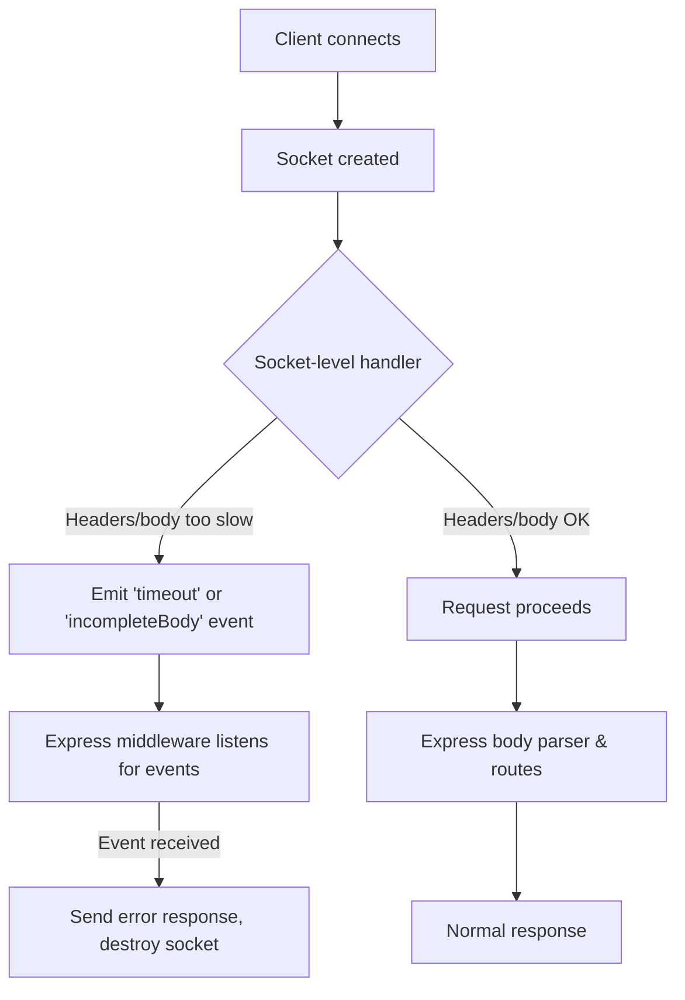

# slow-body

The handling of badly behaved or slow clients is a bit fragmented and not well-solved in the Express ecosystem. Most of the problems actually come from Node itself, and Express does not attempt to handle it for you.

Servers supporting GraphQL operations, and/or supporting Mobile clients, are particularly vulnerable to the problem of clients slowly drip-feeding their request bodies.
These bad clients effectively act as a slow loris attack. Rather than keep the sockets open until the request _eventually_, _maybe_ completes, this package will close the connections after a configurable timeout.

## How It Works

When a client connects, the server-level handler attaches custom event emitters (such as `'timeout'` and `'incompleteBody'`) to each socket. These events are triggered if the client is too slow to send headers or the full body.

The provided Express middleware (`slowBodyTimeout`) listens for these socket events and handles them at the request/response layer, making it easier to integrate with your existing Express error handling and logging. This separation of concerns allows you to handle slow clients at both a low level (socket) and a high level (Express), which is rare in the Node/Express ecosystem.

If you prefer, you can listen to these socket events yourself and implement custom handling, bypassing the provided middleware.



## Features

- Socket-level monitoring before Express middleware processing
- Precise tracking of headers vs body data
- Configurable timeout for body delivery
- Works with Express's error handling system
- Compatible with other Express middleware
- TypeScript support

## Installation

```bash
npm install slow-body
```

## Usage

```typescript
import express from 'express';
import { setupSocketTimeout, slowBodyTimeout } from 'slow-body';

const app = express();
const port = 3000;
const server = app.listen(port, () => {
  console.log(`Example app listening at http://localhost:${port}`);
});

// Set up socket-level timeout handling (must be called after app.listen)
setupSocketTimeout(server, 10000); // 10 second timeout

// Add the Express middleware to handle timeouts
app.use(slowBodyTimeout(console.error));

// Now it's safe to use body parsing middleware
app.use(express.json());

// Your routes here
app.post('/upload', (req, res) => {
  // Request body will be automatically monitored
  // Slow requests will be terminated before reaching body parsing
});
```

## API

### setupSocketTimeout(server: Server, time?: number)

Sets up socket-level timeout handling. Must be called after creating the HTTP server.

- `server`: The HTTP server instance
- `time`: Timeout in milliseconds (default: 10000)

### slowBodyTimeout(loggingFn?: (error: Error) => void)

Creates Express middleware to handle socket timeouts.

- `loggingFn`: Optional function to log timeout errors (default: console.error)

## Error Handling

The middleware handles slow body errors directly by sending a response and destroying the request. It does not call `next(err)`. For other errors, use a standard Express error handler.

When a timeout or incomplete body is detected, the middleware will:

1. Log the error using the provided logging function
2. Send a 408 (timeout) or 400 (incomplete body) response
3. Call both `res.end()` and `req.destroy()` to ensure the socket is closed and not left in-use (this prevents resource leaks and slowloris attacks)

**Note:** You do not need to handle slow body errors in your error handler, but you should still have a generic error handler for other errors.

## Example

See the [examples/basic](examples/basic) directory for a complete working example that demonstrates:

- Basic request handling
- Slow client detection
- Error handling
- Request logging

## License

MIT