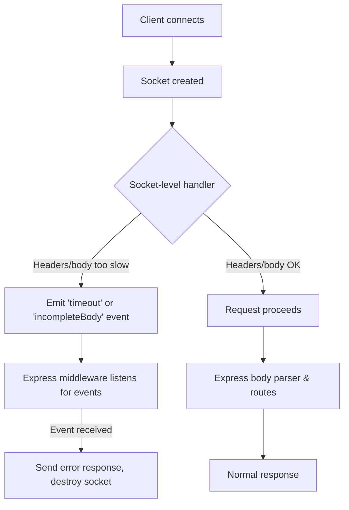

# slow-body

The handling of badly behaved or slow clients is a bit fragmented and not well-solved in the Express ecosystem. Node is not helping matters, and Express does not attempt to handle it for you.

To be fair, this specific scenario is limited by the HTTP 1.1 spec, which Node is adhering to strictly here. It requires that the entirety of request bodies are read before a response can be written.

Servers supporting GraphQL operations, and/or supporting Mobile clients, are particularly vulnerable to the problem of clients slowly drip-feeding their request bodies.
These bad clients effectively act as a slow loris attack. Rather than keep the sockets open until the request _eventually_, _maybe_ completes, this package will close the connections after a configurable timeout.

This *is* rather rude, and clients will probably throw exceptions when they try to write their next byte to a closed socket.


## How It Works

When a client connects, the server-level handler attaches custom event emitters (such as `'timeout'` and `'incompleteBody'`) to each socket. These events are triggered if the client is too slow to send headers or the full body.

The provided Express middleware (`slowBodyTimeout`) listens for these socket events and handles them at the request/response layer, making it easier to integrate with your existing Express error handling and logging. This separation of concerns allows you to handle slow clients at both a low level (socket) and a high level (Express), which is rare in the Node/Express ecosystem.

If you prefer, you can listen to these socket events yourself and implement custom handling, bypassing the provided middleware.



## Features

- Socket-level monitoring before Express middleware processing
- Precise tracking of headers vs body data
- Configurable timeout for body delivery
- Works with Express's error handling system
- Compatible with other Express middleware
- TypeScript support

## Installation

```bash
npm install slow-body
```

## Usage

```typescript
import express from 'express';
import { setupSocketTimeout, slowBodyTimeout } from 'slow-body';

const app = express();
const port = 3000;

// Basic request logging middleware
app.use((req, res, next) => {
  const start = Date.now();
  res.on("finish", () => {
    const duration = Date.now() - start;
    console.log(`${req.method} ${req.url} ${res.statusCode} - ${duration}ms`);
  });
  next();
});

// Use the slow-body middleware with custom options
app.use(slowBodyTimeout(10000, console.error));

// Parse JSON bodies - this should not hang if the body is slow to arrive
app.use(express.json());

// Test endpoint for normal requests
app.post("/upload", (req, res) => {
  console.log("Received request body:", req.body);
  res.json({
    message: "Request processed successfully",
    bodySize: JSON.stringify(req.body).length,
  });
});

// Generic error handler (slow body errors are handled directly by the middleware above)
app.use((err, req, res, next) => {
  console.error("Error:", {
    name: err.name,
    message: err.message,
    stack: err.stack,
    url: req.url,
    method: req.method,
    headers: req.headers,
  });
  res.status(500).json({
    error: err.message,
    name: err.name,
  });
});

const server = app.listen(port, () => {
  console.log(`Example app listening at http://localhost:${port}`);
});

// Set up socket-level timeout handling (must be called after app.listen)
setupSocketTimeout(10000, server); // 10s timeout
```

## API

### setupSocketTimeout(time: number, server: Server)

Sets up socket-level timeout handling. Must be called after creating the HTTP server.

- `time`: Timeout in milliseconds (default: 10000)
- `server`: The HTTP server instance

### slowBodyTimeout(time?: number, loggingFn?: (error: Error) => void)

Creates Express middleware to handle socket timeouts.

- `time`: Timeout in milliseconds (default: 10000)
- `loggingFn`: Optional function to log timeout errors (default: console.error)

## Error Handling & Node.js HTTP Protocol Limitations

The middleware attempts to send a 408 (timeout) or 400 (incomplete body) response and then destroys the request. **However, due to Node.js's strict HTTP/1.1 protocol enforcement, if the request body is not fully received, the response may not actually be sent and the client may see a connection reset or protocol error instead.**

This is a limitation of Node.js and the HTTP/1.1 spec: the server is expected to read the entire request body before sending a response. Destroying the socket is the only way to immediately free resources, but it means the client will not receive a valid HTTP response.

When a timeout or incomplete body is detected, the middleware will:

1. Log the error using the provided logging function
2. Send a 408 (timeout) or 400 (incomplete body) response, if possible
3. Call `req.destroy()` to ensure the socket is closed and not left in-use (this prevents resource leaks and slowloris attacks)

**Note:** You do not need to handle slow body errors in your error handler, but you should still have a generic error handler for other errors.

## Example

See the [examples/basic](examples/basic) directory for a complete working example that demonstrates:

- Basic request handling
- Slow client detection
- Error handling
- Request logging

## License

MIT
